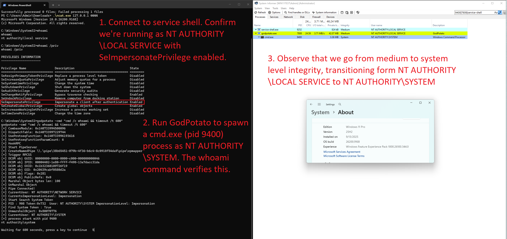
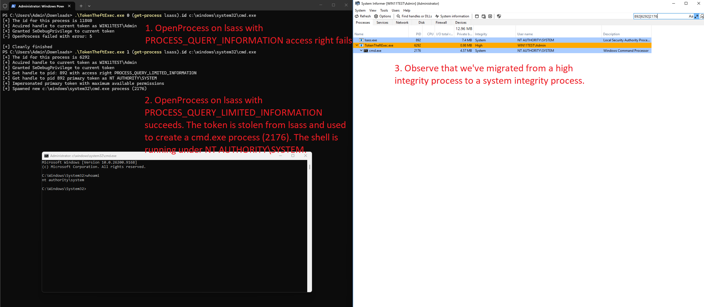

# Token Theft
Token theft is a windows post-exploitation technique which allows a process or thread to impersonate the security context of a target process or thread. For instance, we can migrate to `NT AUTHORITY\SYSTEM` security context from a high integrity process running under the security context of an account within the Administrators group.

# Underlying mechanics which make this attack possible
Windows introduced a feature known as [**Impersonation**](https://learn.microsoft.com/en-us/windows/win32/com/impersonation) way back in 1993 when Windows NT 3.1 was released. This feature allows an application to impersonate the security context of an application user, enabling the application to safely perform actions on behalf of the user which could be considered insecure if done from the security context of the server application itself. 

For instance, we might have a file server application which manages the data for various users and has full access to the file system. Without impersonation, a user could send a read or write request and modify the data of another user as the request would be processed by the file server app using its own security context which has full access to the file system. With impersonation, the file server app can first acquire the security context of the calling user before performing the action specified by the request. The same read or write request to another users data would now fail since the file server app is performing the operation under the security context of the calling user.

This model had security issues where rogue servers which could intercept a user request and abuse the impersonation mechanism to perform an action under the security context of the user. To combat this issue, Microsoft introduced the **SeImpersonatePrivilege** privilege in Windows 2000 SP4. Without this privilege, a process can not impersonate the security context of another user. By default, members of the Administrators group and the `NT AUTHORITY\Local Service` account have this privilege. 

###### SeImpersonatePrivilege privilege distribution model as described by Microsoft
> By default, members of the device's local Administrators group and the device's local Service account are assigned the "Impersonate a client after authentication" user right. The following components also have this user right:
>    - Services that are started by the Service Control Manager
>    - Component Object Model (COM) servers that are started by the COM infrastructure and that are configured to run under a specific account
>
> [Issue 1: the "Impersonate a Client AfterAuthentication" User Right (SeImpersonatePrivilege)](https://learn.microsoft.com/en-us/troubleshoot/windows-server/windows-security/seimpersonateprivilege-secreateglobalprivilege#issue-1-the-impersonate-a-client-afterauthentication-user-right-seimpersonateprivilege)

In 2007 with the release of Windows Vista & Windows Server 2008, Microsoft introduced the concept of [Mandatory Integrity Control](https://learn.microsoft.com/en-us/windows/win32/secauthz/mandatory-integrity-control) which added an additional requirement for impersonation where the process must also have an integrity level of at least medium based on the behaviour i have observed in my own research.

## Abusing Token Impersonation
To abuse the impersonation feature in modern windows, we must acquire a token. This token can be acquired in one of two ways. The first way is taking it from another process and the other way is having the process give it to us. The take approach has increased pre-requisites in comparison to the give approach. In both approaches, we must have **SeImpersonatePrivilege**. Mitre identifies  this technique as [T1134.001 -  Access Token Manipulation: Token Impersonation/Theft](https://attack.mitre.org/techniques/T1134/001/).

### The Give Approach
This is the old fashioned approach where users & system services are tricked into authenticating to a malicious server which provides gives the malicious server the token. In the modern era, these are known as potato attacks. The latest iteration of the potato attack is [GodPotato](https://github.com/BeichenDream/GodPotato). GodPotato triggers the RpcSs service to authenticate to a malicious named pipe which captures the token of the RpcSs service which runs under `NT AUTHORITY\SYSTEM`. From what i have observed, god potato will work in a medium integrity process running under the user context of `NT AUTHORITY\Local Service`.

  
Click to view godpotato demo image

  

### The Take Approach
This approach is known as token theft, where we take or steal the token from a target. To do this, we need to be running in a high integrity process with the **SeDebugPrivilege**. This privilege requires a high integrity level & gives our process the ability to interact with the memory space of any process on the system including `NT AUTHORITY\SYSTEM` thus enabling us to steal the token and impersonate the system account.

    
Click to view theft demo

## Abusing the impersonated token
There are various win32 api calls which can be used to abuse the token. The PoC in this repo uses the [CreateProcessWithTokenW](https://learn.microsoft.com/en-us/windows/win32/api/winbase/nf-winbase-createprocesswithtokenw) function to create a new process with the stolen token. GodPotato also [uses](https://github.com/BeichenDream/GodPotato/blob/59f66583474fb0297b7447551460e1072de324c0/SharpToken.cs#L1313) this API call to spawn a process if **CreateProcessAsUserW** fails.

There are other ways in which the impersonated token can be abused however this is out of scope for this document at this time.

# References
[Impersonation](https://learn.microsoft.com/en-us/windows/win32/com/impersonation)  
[Overview of the impersonate a client after authentication and the create global objects security settings](https://learn.microsoft.com/en-us/troubleshoot/windows-server/windows-security/seimpersonateprivilege-secreateglobalprivilege#issue-1-the-impersonate-a-client-afterauthentication-user-right-seimpersonateprivilege)   
[Mandatory Integrity Control](https://learn.microsoft.com/en-us/windows/win32/secauthz/mandatory-integrity-control)  